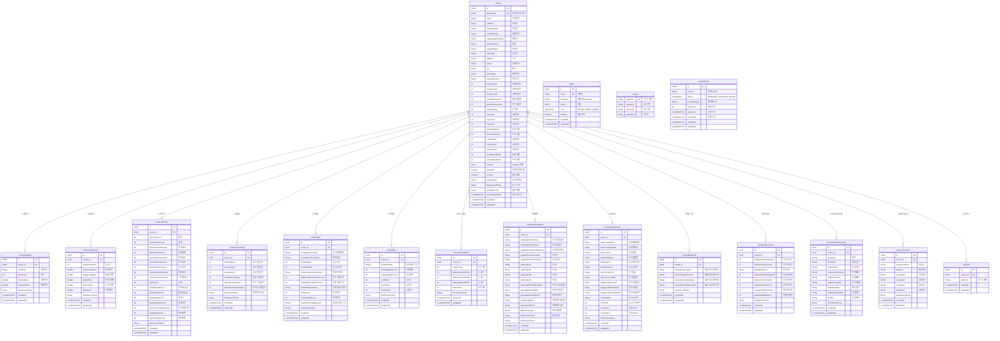

# ERD (Entity Relationship Diagram)

```mermaid
erDiagram
    %% ========== Center (Core) ==========
    Center {
        UUID id PK
        String kinderCode UK "유치원 고유코드"
        String name "유치원명"
        String officEdu "교육청"
        String subOfficeEdu "지원청"
        String establishType "설립유형"
        String representativeName "대표자"
        String directorName "원장"
        String establishDate "설립일"
        String openDate "개원일"
        String address "주소"
        String phone "전화번호"
        String fax "팩스"
        String homepage "홈페이지"
        String operatingHours "운영시간"
        Int classCount3 "3세 학급수"
        Int classCount4 "4세 학급수"
        Int classCount5 "5세 학급수"
        Int mixedClassCount "혼합 학급수"
        Int specialClassCount "특수 학급수"
        Int totalCapacity "총 정원"
        Int capacity3 "3세 정원"
        Int capacity4 "4세 정원"
        Int capacity5 "5세 정원"
        Int mixedCapacity "혼합 정원"
        Int specialCapacity "특수 정원"
        Int enrollment3 "3세 현원"
        Int enrollment4 "4세 현원"
        Int enrollment5 "5세 현원"
        Int mixedEnrollment "혼합 현원"
        Int specialEnrollment "특수 현원"
        Point location "PostGIS 좌표"
        Boolean isVerified "관리자 검증여부"
        Boolean isActive "활성 여부"
        String adminMemo "관리자 메모"
        String disclosureTiming "공시 시기"
        String actingDirector "원장 대행"
        LocalDateTime sourceUpdatedAt "원본 갱신일"
        LocalDateTime createdAt
        LocalDateTime updatedAt
    }

    %% ========== Center 1:1 Child Entities ==========
    CenterBuilding {
        UUID id PK
        UUID center_id FK
        String archYear "건축연도"
        Int floorCount "층수"
        Double buildingArea "건물면적"
        Double totalLandArea "대지면적"
        String disclosureTiming
        LocalDateTime createdAt
        LocalDateTime updatedAt
    }

    CenterClassroom {
        UUID id PK
        UUID center_id FK
        Int classroomCount "교실수"
        Double classroomArea "교실면적"
        Double playgroundArea "체육장면적"
        Double healthArea "보건실면적"
        Double kitchenArea "급식실면적"
        Double otherArea "기타면적"
        String disclosureTiming
        LocalDateTime createdAt
        LocalDateTime updatedAt
    }

    CenterTeacher {
        UUID id PK
        UUID center_id FK
        Int directorCount "원장"
        Int viceDirectorCount "원감"
        Int masterTeacherCount "수석교사"
        Int leadTeacherCount "부장교사"
        Int generalTeacherCount "일반교사"
        Int specialTeacherCount "특수교사"
        Int healthTeacherCount "보건교사"
        Int nutritionTeacherCount "영양교사"
        Int contractTeacherCount "기간제교사"
        Int staffCount "직원"
        Int masterQualCount "정교사(1급)"
        Int grade1QualCount "정교사(2급)"
        Int grade2QualCount "준교사"
        Int assistantQualCount "보조교사"
        Int specialSchoolQualCount "특수학교자격"
        Int healthQualCount "보건자격"
        Int nutritionQualCount "영양자격"
        String disclosureTiming
        LocalDateTime createdAt
        LocalDateTime updatedAt
    }

    CenterLessonDay {
        UUID id PK
        UUID center_id FK
        Int lessonDays3 "3세 수업일수"
        Int lessonDays4 "4세 수업일수"
        Int lessonDays5 "5세 수업일수"
        Int mixedLessonDays "혼합 수업일수"
        Int specialLessonDays "특수 수업일수"
        Int afterSchoolLessonDays "방과후 수업일수"
        String belowLegalDays "법정일수 미달"
        String disclosureTiming
        LocalDateTime createdAt
        LocalDateTime updatedAt
    }

    CenterMeal {
        UUID id PK
        UUID center_id FK
        String mealOperationType "급식운영형태"
        String consignmentCompany "위탁업체"
        Int totalChildren "총원아수"
        Int mealChildren "급식원아수"
        String nutritionTeacherAssigned "영양사 배치"
        Int singleNutritionTeacherCount "단독 영양사수"
        Int jointNutritionTeacherCount "공동 영양사수"
        String jointInstitutionName "공동관리 기관명"
        Int cookCount "조리사수"
        Int cookingStaffCount "조리원수"
        String massKitchenRegistered "집단급식소 신고"
        String disclosureTiming
        LocalDateTime createdAt
        LocalDateTime updatedAt
    }

    CenterBus {
        UUID id PK
        UUID center_id FK
        String busOperating "통학차량 운영"
        Int operatingBusCount "운영대수"
        Int registeredBusCount "신고대수"
        Int bus9Seat "9인승"
        Int bus12Seat "12인승"
        Int bus15Seat "15인승"
        String disclosureTiming
        LocalDateTime createdAt
        LocalDateTime updatedAt
    }

    CenterYearOfWork {
        UUID id PK
        UUID center_id FK
        Int under1Year "1년 미만"
        Int between1And2Years "1~2년"
        Int between2And4Years "2~4년"
        Int between4And6Years "4~6년"
        Int over6Years "6년 이상"
        String disclosureTiming
        LocalDateTime createdAt
        LocalDateTime updatedAt
    }

    CenterEnvironment {
        UUID id PK
        UUID center_id FK
        String airQualityCheckDate "공기질 점검일"
        String airQualityCheckResult "공기질 결과"
        String regularDisinfectionRequired "소독 필요여부"
        String regularDisinfectionDate "소독일"
        String regularDisinfectionResult "소독 결과"
        String waterType01 "수질1"
        String waterType02 "수질2"
        String waterType03 "수질3"
        String waterType04 "수질4"
        String groundwaterTestRequired "지하수 검사필요"
        String groundwaterTestDate "지하수 검사일"
        String groundwaterTestResult "지하수 결과"
        String dustCheckDate "미세먼지 점검일"
        String dustCheckResult "미세먼지 결과"
        String lightCheckDate "조도 점검일"
        String lightCheckResult "조도 결과"
        String disclosureTiming
        LocalDateTime createdAt
        LocalDateTime updatedAt
    }

    CenterSafetyCheck {
        UUID id PK
        UUID center_id FK
        String fireEvacuationYn "소방대피훈련"
        String fireEvacuationDate "소방대피일"
        String gasCheckYn "가스점검"
        String gasCheckDate "가스점검일"
        String fireSafetyYn "소방안전점검"
        String fireSafetyDate "소방안전일"
        String electricCheckYn "전기점검"
        String electricCheckDate "전기점검일"
        String playgroundCheckYn "놀이시설점검"
        String playgroundCheckDate "놀이시설일"
        String playgroundCheckResult "놀이시설결과"
        String cctvInstalled "CCTV 설치"
        Int cctvTotal "CCTV 총대수"
        Int cctvIndoor "실내 CCTV"
        Int cctvOutdoor "실외 CCTV"
        String disclosureTiming
        LocalDateTime createdAt
        LocalDateTime updatedAt
    }

    CenterMutualAid {
        UUID id PK
        UUID center_id FK
        String schoolSafetyTarget "학교안전공제 대상"
        String schoolSafetyEnrolled "학교안전공제 가입"
        String educationFacilityTarget "교육시설공제 대상"
        String educationFacilityEnrolled "교육시설공제 가입"
        String disclosureTiming
        LocalDateTime createdAt
        LocalDateTime updatedAt
    }

    CenterAfterSchool {
        UUID id PK
        UUID center_id FK
        Int independentClassCount "독립 학급수"
        Int afternoonClassCount "오후 학급수"
        String operatingHours "운영시간"
        Int independentParticipants "독립 참여자"
        Int afternoonParticipants "오후 참여자"
        Int regularTeacherCount "정규 교사수"
        Int contractTeacherCount "계약 교사수"
        Int dedicatedStaffCount "전담 인력수"
        String disclosureTiming
        LocalDateTime createdAt
        LocalDateTime updatedAt
    }

    %% ========== Center 1:N Child Entities ==========
    CenterSafetyEducation {
        UUID id PK
        UUID center_id FK
        String semester "학기"
        String lifeSafety "생활안전"
        String trafficSafety "교통안전"
        String violencePrevention "폭력예방"
        String drugPrevention "약물예방"
        String cyberPrevention "사이버예방"
        String disasterSafety "재난안전"
        String occupationalSafety "직업안전"
        String firstAid "응급처치"
        String disclosureTiming
        LocalDateTime createdAt
        LocalDateTime updatedAt
    }

    CenterInsurance {
        UUID id PK
        UUID center_id FK
        String insuranceName "보험명"
        String targetYn "대상여부"
        String enrolledYn "가입여부"
        String company1 "보험사1"
        String company2 "보험사2"
        String company3 "보험사3"
        String disclosureTiming
        LocalDateTime createdAt
        LocalDateTime updatedAt
    }

    %% ========== Standalone Entities ==========
    Admin {
        UUID id PK
        String email UK "이메일"
        String password "비밀번호(BCrypt)"
        String name "이름"
        AdminRole role "SUPER_ADMIN | ADMIN"
        Boolean isActive "활성 여부"
        LocalDateTime createdAt
        LocalDateTime updatedAt
    }

    Favorite {
        UUID id PK
        UUID center_id FK
        String deviceId "기기 식별자"
        LocalDateTime createdAt
        LocalDateTime updatedAt
    }

    Region {
        String sggCode PK "시군구 코드"
        String sggName "시군구명"
        String sidoCode "시도 코드"
        String sidoName "시도명"
    }

    CrawlHistory {
        UUID id PK
        String source "데이터 출처"
        CrawlStatus status "RUNNING | SUCCESS | FAILED"
        String errorMessage "에러 메시지"
        Int itemCount "처리 건수"
        LocalDateTime startedAt "시작 시각"
        LocalDateTime finishedAt "종료 시각"
        LocalDateTime createdAt
        LocalDateTime updatedAt
    }

    %% ========== Relationships ==========
    Center ||--o| CenterBuilding : "건물정보"
    Center ||--o| CenterClassroom : "교실정보"
    Center ||--o| CenterTeacher : "교사정보"
    Center ||--o| CenterLessonDay : "수업일수"
    Center ||--o| CenterMeal : "급식정보"
    Center ||--o| CenterBus : "통학차량"
    Center ||--o| CenterYearOfWork : "교사 근속연수"
    Center ||--o| CenterEnvironment : "환경위생"
    Center ||--o| CenterSafetyCheck : "안전점검"
    Center ||--o| CenterMutualAid : "공제회 가입"
    Center ||--o| CenterAfterSchool : "방과후과정"
    Center ||--o{ CenterSafetyEducation : "안전교육(학기별)"
    Center ||--o{ CenterInsurance : "보험가입(N건)"
    Center ||--o{ Favorite : "즐겨찾기"
```
